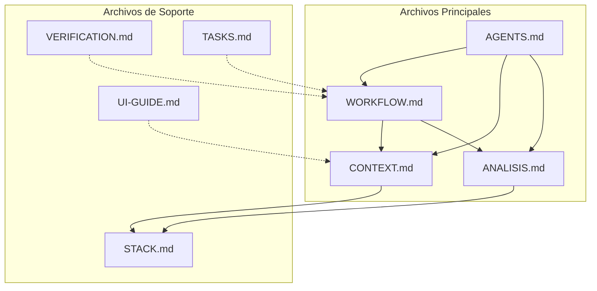
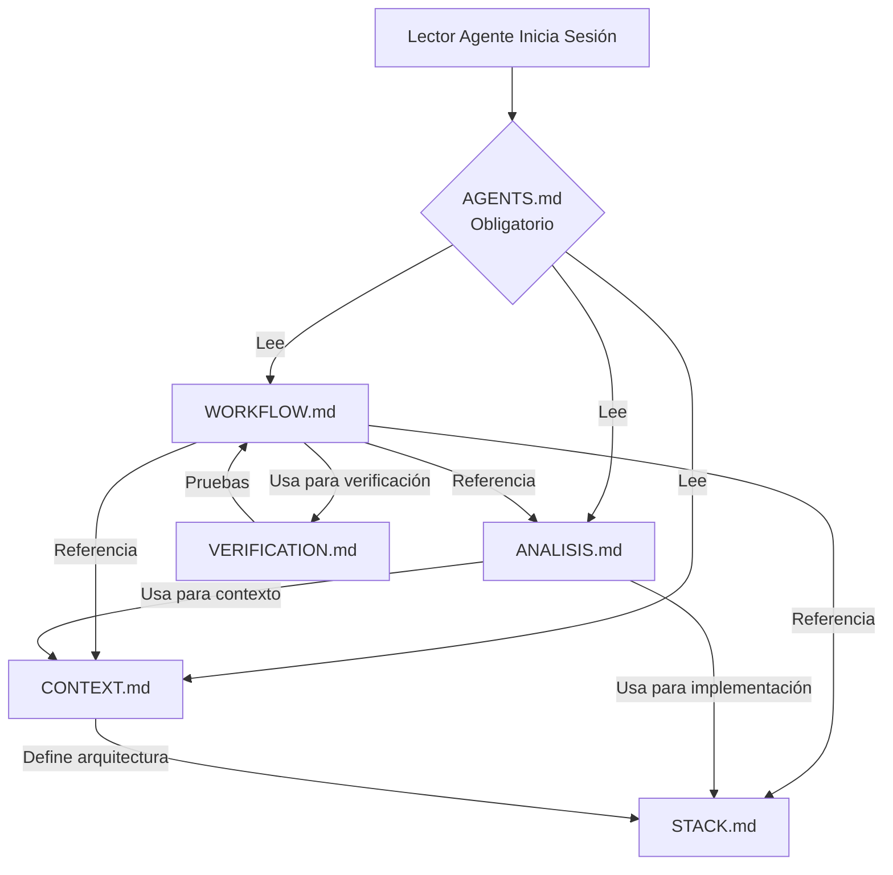
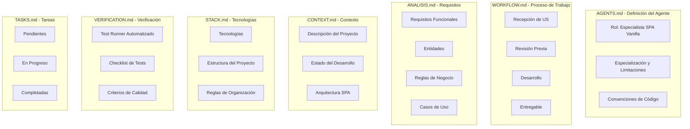
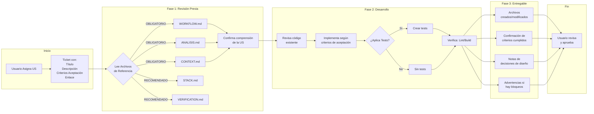
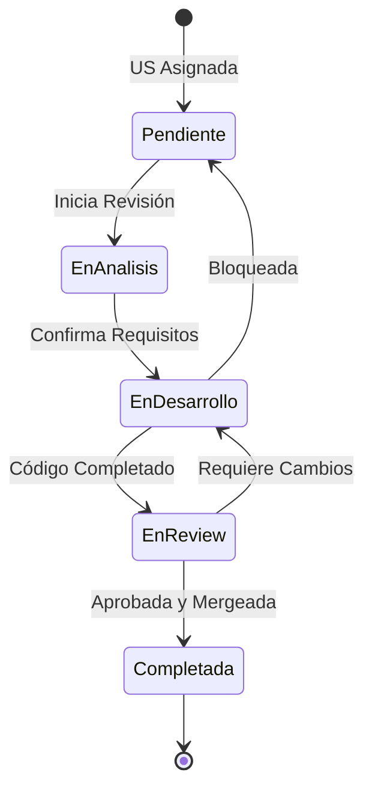
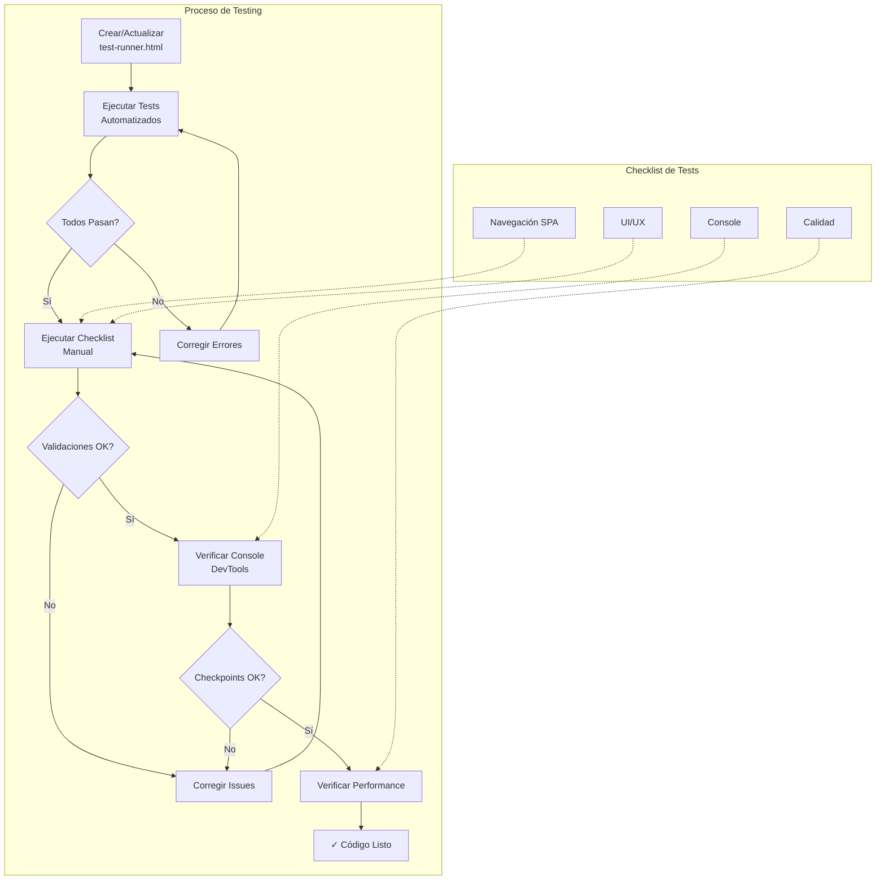
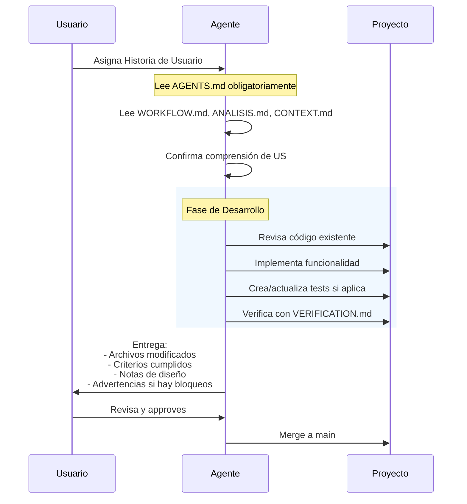
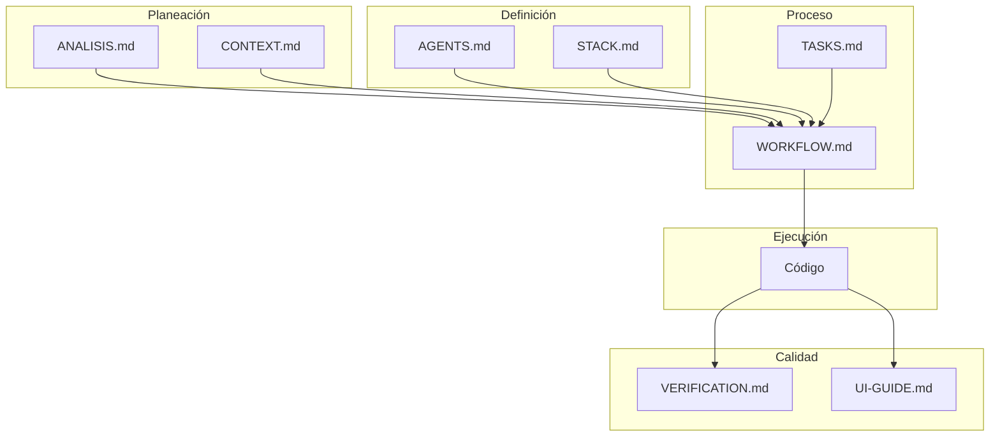

# MERMAID.md - Diagramas de Relaciones y Workflow

---

## 1. Relación entre Archivos de Plantillas

### Diagrama de Arquitectura de Archivos

### Diagrama de Dependencias de Lectura

### Diagrama de Propósito por Archivo

---

## 2. Workflow Completo

### Flujo de Desarrollo de Historias de Usuario

### Diagrama de Estados de la US

### Workflow de Verificación

### Flujo Completo de Sesión de Desarrollo

---

## 3. Resumen Visual

---

## Leyenda

| Símbolo | Significado |
|---------|-------------|
| → | Flujo principal |
| -.-> | Referencia indirecta |
| { } | Decisión/Condición |
| Rectángulo punteado | Grupo conceptual |

---

*Este documento muestra la estructura y relaciones entre las plantillas del proyecto SPA.*