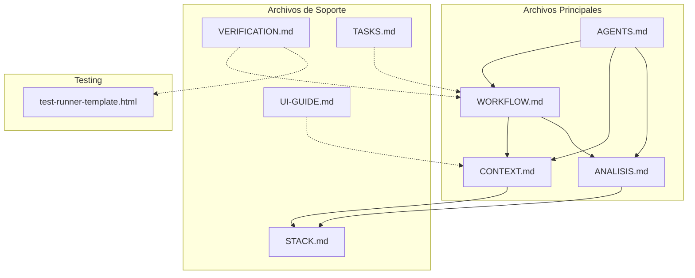
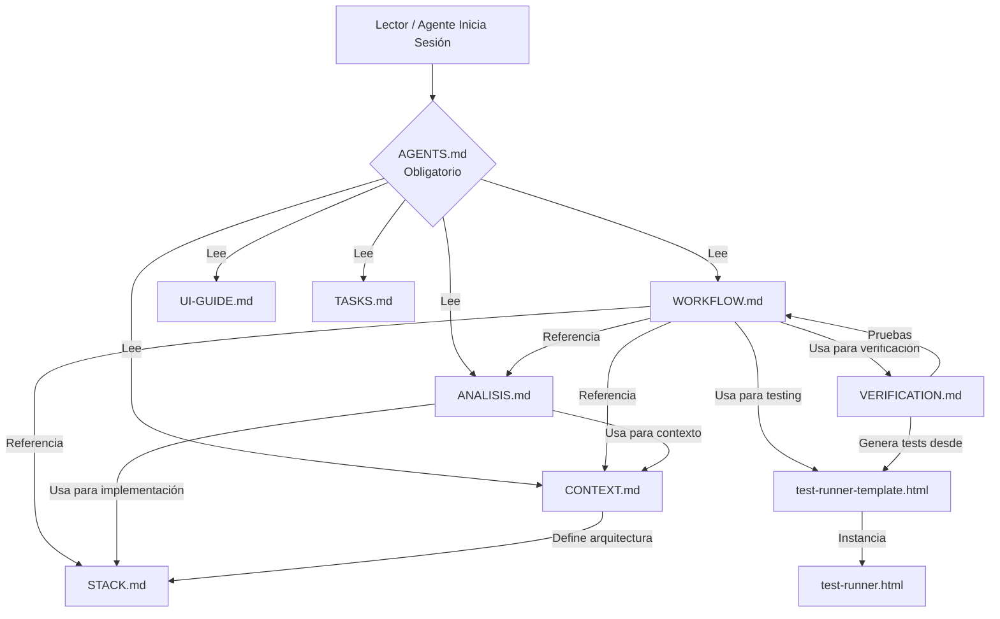
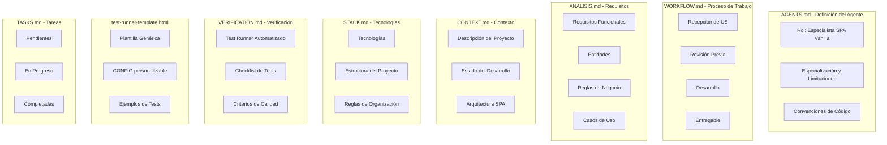
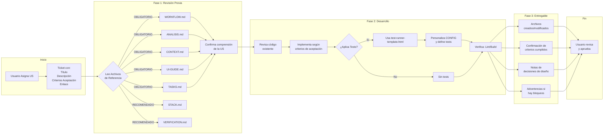
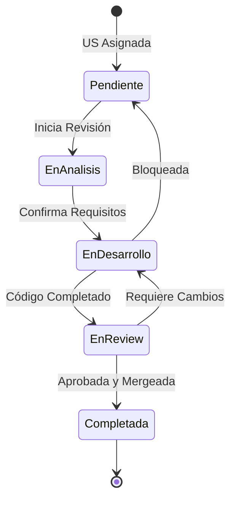
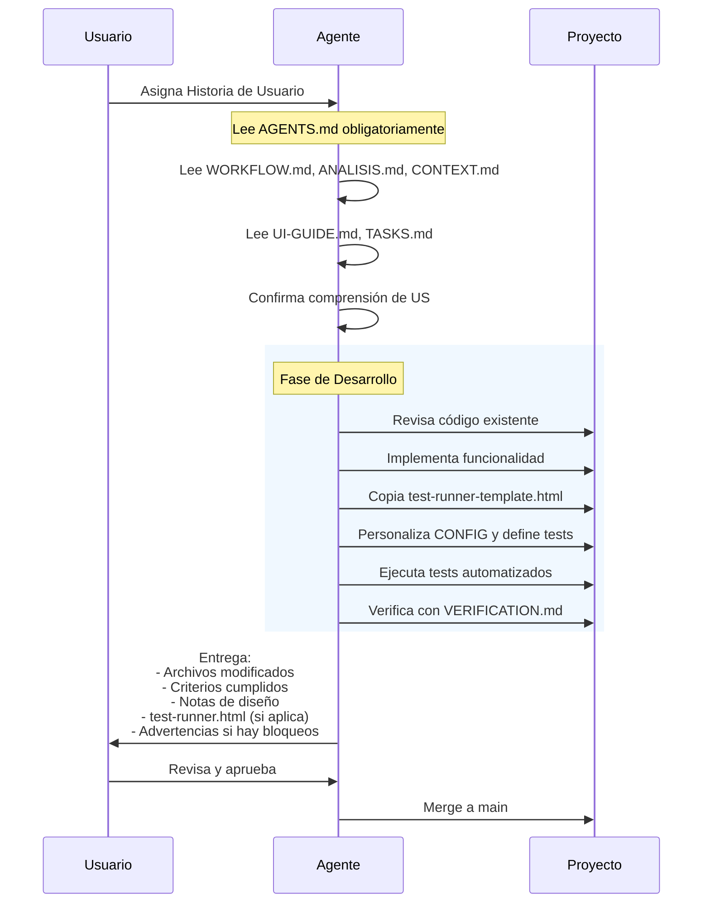
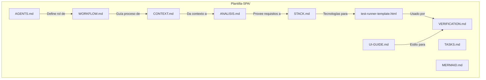
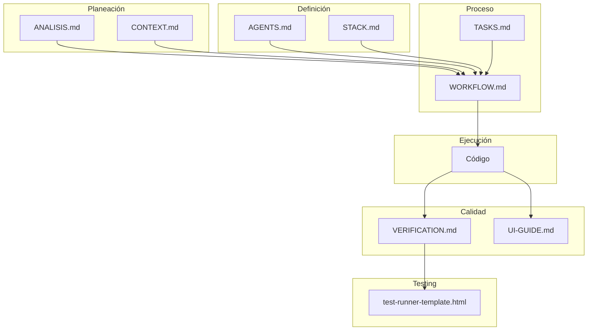
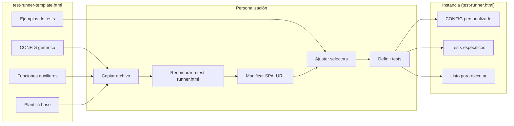

# MERMAID.md - Diagramas de Relaciones y Workflow

---

## 1. Relación entre Archivos de Plantillas

### Diagrama de Arquitectura de Archivos



### Diagrama de Dependencias de Lectura



### Diagrama de Propósito por Archivo



---

## 2. Workflow Completo

### Flujo de Desarrollo de Historias de Usuario



### Diagrama de Estados de la US



### Workflow de Testing con test-runner-template.html

```mermaid
flowchart TB
    subgraph TESTING["Proceso de Testing"]
        A[Copiar<br/>test-runner-template.html] --> B[Renombrar a<br/>test-runner.html]
        B --> C[Personalizar CONFIG]
        C --> D[Definir Tests en<br/>runAllTestsSequence()]
        D --> E[Servir con<br/>HTTP Server]
        E --> F[Abrir test-runner.html<br/>en navegador]
        F --> G[Click en<br/>Ejecutar Todos]
        G --> H{Tests Pasan?}
        H -->|Sí| I[Ejecutar Checklist<br/>Manual]
        H -->|No| J[Revisar logs y<br/>corregir]
        J --> G

        I --> K{Validaciones OK?}
        K -->|Sí| L[Verificar Console<br/>DevTools]
        K -->|No| M[Corregir Issues]
        M --> I

        L --> N{Checkpoints OK?}
        N -->|Sí| O[Verificar Performance]
        N -->|No| M

        O --> P[✓ Código Listo]
    end

    subgraph CONFIG["Configuración del Test Runner"]
        Q[SPA_URL: 'index.html']
        R[IFRAME_SELECTOR: '#app-frame']
        S[BASE_DELAY: 500]
        T[SUBMIT_DELAY: 2000]
    end

    subgraph TIPOS_TEST["Tipos de Tests Soportados"]
        U[Create - Crear elementos]
        V[Update - Editar elementos]
        W[Delete - Eliminar elementos]
        X[Filtros - Aplicar filtros]
        Y[Export - Exportar datos]
    end

    C -.-> Q
    C -.-> R
    C -.-> S
    C -.-> T

    D -.-> U
    D -.-> V
    D -.-> W
    D -.-> X
    D -.-> Y
```

### Flujo Completo de Sesión de Desarrollo



---

## 3. Estructura de Archivos de Plantilla



---

## 4. Resumen Visual



---

## 5. Testing: De Plantilla a Instancia



---

## Leyenda

| Símbolo | Significado |
|---------|-------------|
| → | Flujo principal |
| -.-> | Referencia indirecta |
| { } | Decisión/Condición |
| Rectángulo punteado | Grupo conceptual |

---

*Este documento muestra la estructura y relaciones entre las plantillas del proyecto SPA, incluyendo el flujo de testing con test-runner-template.html.*